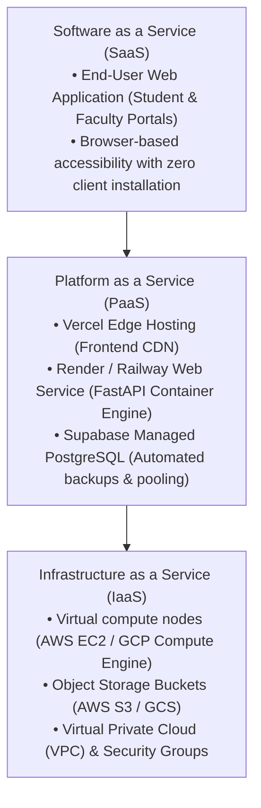
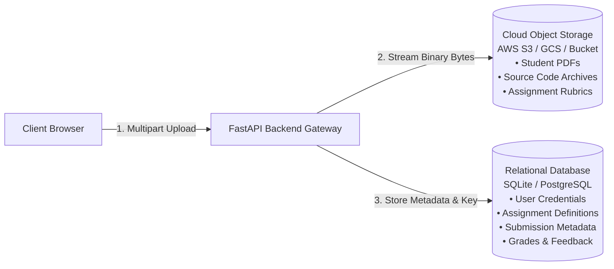
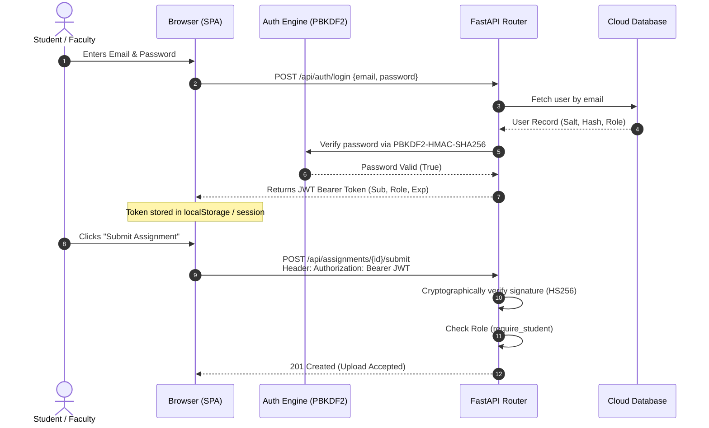

# Cloud Computing Concepts & Architecture Deep Dive

This document provides a thorough theoretical and practical analysis of the cloud computing paradigms, architectural patterns, and security mechanisms demonstrated by the **Cloud-Based Student Assignment Submission & Feedback Portal**.

---

## 1. Cloud Service Models (SaaS, PaaS, IaaS)

The application illustrates how modern software utilizes multiple cloud service models simultaneously:



### Detailed Breakdown

1. **Software as a Service (SaaS)**:
   - The end-users (students and faculty) consume the assignment portal entirely through a web browser.
   - Users do not manage servers, virtual machines, database indexes, or storage disks; they interact with application-level abstractions (uploading, grading, downloading, feedback tracking).

2. **Platform as a Service (PaaS)**:
   - **Vercel**: Deploys and serves the static frontend assets via globally distributed Edge CDN nodes with automatic TLS certificate renewal.
   - **Render**: Hosts the containerized FastAPI backend. Render manages the operating system, container orchestration, dynamic port allocation (`$PORT`), process supervisor, and liveness monitoring without requiring manual VM provisioning.

3. **Infrastructure as a Service (IaaS)**:
   - Underneath Render and Vercel, hyper-converged hardware (AWS Nitro, Google Cloud Borg) supplies the physical compute cores, RAM, and object storage partitions where byte buffers are safely stored.

---

## 2. Decoupled Cloud Storage Architecture

A central design pattern implemented in this project is the **separation of structured relational metadata from unstructured binary objects**.



### Why BLOBs in Relational Databases Are an Anti-Pattern
In legacy systems, files were often stored as binary BLOBs directly in SQL tables (`BYTEA` or `BLOB`). In cloud environments, this causes:
- **Buffer Pool Pollution**: Relational database caches (like PostgreSQL shared buffers or InnoDB buffer pools) get saturated with megabytes of binary file chunks instead of caching active index pages and query results.
- **Inflated Backup Windows**: Logical database dumps (`pg_dump`) expand into tens of gigabytes, making point-in-time recovery and replication painfully slow.
- **Cost Inefficiency**: High-performance IOPS provisioned on SSD cloud database storage (e.g., AWS EBS gp3 or io2) costs up to 10× more per gigabyte than object storage (AWS S3 Standard at ~$0.023/GB/month).

### The Solution: Decoupled Object Storage
1. The client streams the file to the FastAPI backend.
2. The backend writes the payload into an isolated path:  
   `assignments/{assignment_id}/{student_id}/{timestamp}_{filename}`
3. The database records only the metadata:  
   `file_url`, `storage_path`, `file_size_bytes`, `submitted_at`, and `submission_status`.
4. Authorized downloads stream directly from the storage driver via byte generators, preserving backend RAM.

---

## 3. Stateless Authentication (12-Factor App)

The application strictly adheres to **Factor VI of the Twelve-Factor App methodology**: *Execute the app as one or more stateless processes*.



### Key Advantages:
- **Horizontal Elasticity**: Because backend nodes maintain no server-side sessions in memory, requests from the same user can be routed to any instance behind a cloud load balancer (e.g., Round Robin, Least Connections) without sticky sessions.
- **Failover Resilience**: If a backend container crashes or restarts during rolling deployment, active users experience zero session loss as long as their cryptographic JWT signature remains valid.

---

## 4. Multi-Tenant Isolation & Zero-Trust Security

Multi-tenancy isolation ensures that students can never inspect, modify, or download peers' submissions:

1. **API Guard Level (`backend/auth.py`)**:
   ```python
   def require_role(*allowed_roles: str):
       def role_checker(current_user: dict = Depends(get_current_user)):
           if current_user["role"] not in allowed_roles:
               raise HTTPException(status_code=403, detail="Forbidden")
           return current_user
       return role_checker
   ```

2. **Row-Level Ownership Validation (`backend/routes/submission_routes.py`)**:
   ```python
   if current_user["role"] == "student" and row["student_id"] != current_user["user_id"]:
       raise HTTPException(
           status_code=403,
           detail="Access denied: You cannot download assignments submitted by other students"
       )
   ```

3. **Storage Boundary Enforcement (`backend/cloud/storage_service.py`)**:
   Path traversal attacks (e.g., `../../etc/passwd` or `../other_student/submission.pdf`) are neutralized by resolving canonical path boundaries:
   ```python
   file_path = (self.bucket_dir / relative_path).resolve()
   if not file_path.is_relative_to(self.bucket_dir):
       raise HTTPException(status_code=400, detail="Invalid path traversal attempt")
   ```

---

## 5. Tamper-Proof Server-Side UTC Deadline Validation

A frequent failure mode in client-validated architectures is reliance on client device clocks. If deadline checking is performed in browser JavaScript or using client headers, a student can adjust their OS clock backwards to submit past the deadline.

In this cloud portal:
- The authoritative deadline validation is executed on the cloud server using standard **UTC (Coordinated Universal Time)**:
  ```python
  now_utc = datetime.now(timezone.utc)
  deadline_utc = datetime.fromisoformat(assignment["deadline"])
  submission_status = "LATE" if now_utc > deadline_utc else "SUBMITTED"
  ```
- Cloud server clocks are synchronized with atomic clocks via NTP (Network Time Protocol), guaranteeing deterministic, auditable deadline enforcement.

---

## 6. Built-In Cloud Plagiarism Detection Engine

The portal includes an automated similarity scanner comparing submissions for identical coursework:
- **Tokenization**: Submissions are parsed and lowercased into alphanumeric word tokens.
- **n-gram Shingling**: Consecutive tokens are grouped into n-grams ($n=3$) to capture sentence structure and localized copying.
- **Jaccard Set Similarity**:
  $$\text{Jaccard Similarity}(A, B) = \frac{|A \cap B|}{|A \cup B|} \times 100\%$$
- **Risk Stratification**:
  - `0% – 25%`: **LOW RISK** (Original work)
  - `26% – 50%`: **MEDIUM RISK** (Shared boilerplate or minor overlap)
  - `> 50%`: **HIGH RISK** (Substantial verbatim plagiarism)
