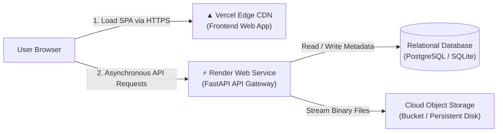
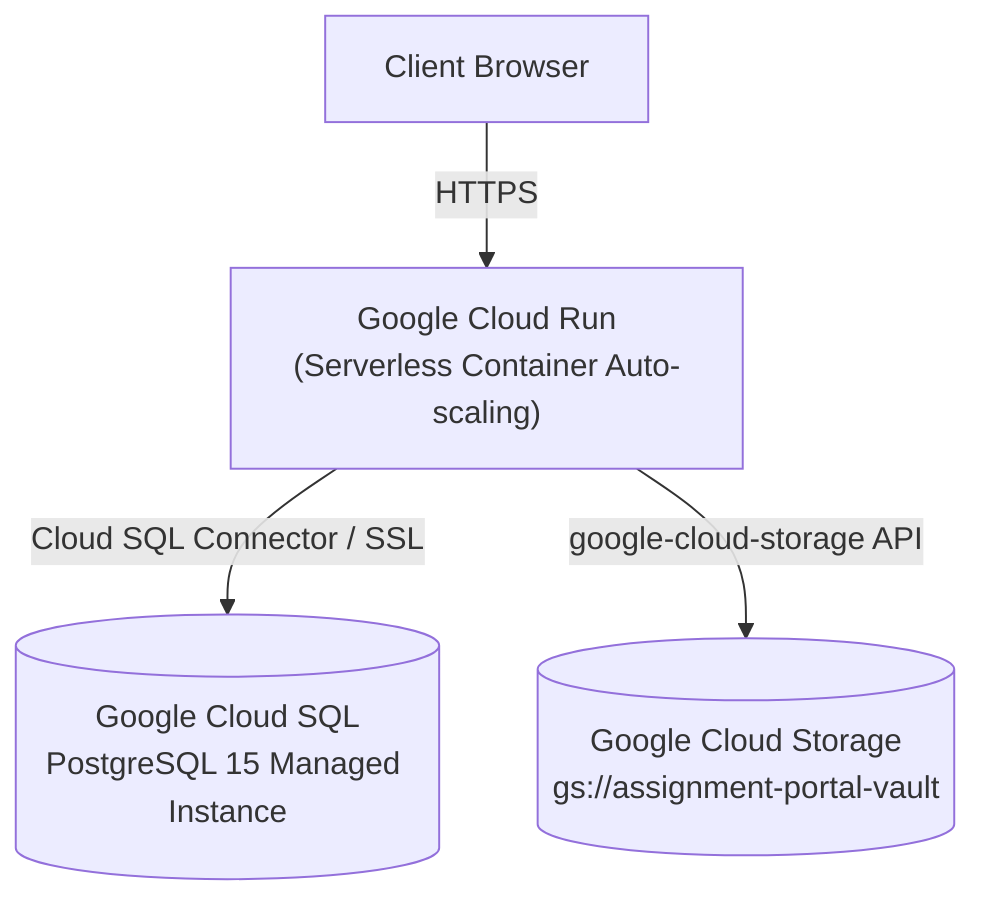

# Production Cloud Deployment Guide

This guide details step-by-step procedures for deploying the **Cloud-Based Student Assignment Submission & Feedback Portal** using both zero-cost student-friendly PaaS platforms (Vercel & Render) and enterprise hyperscale clouds (Docker & Google Cloud Platform).

---

## Deployment Architectures Comparison

| Attribute | Local Development | Free-Tier PaaS (Vercel + Render) | Enterprise (GCP / AWS) |
| :--- | :--- | :--- | :--- |
| **Frontend** | Localhost:8000 (Static) | Vercel Edge Global CDN | Firebase Hosting / S3 + CloudFront |
| **Backend** | Uvicorn ASGI Server | Render Web Service (FastAPI) | Google Cloud Run / AWS ECS |
| **Database** | SQLite (`assignment_portal.db`) | Managed SQLite / Supabase PostgreSQL | Google Cloud SQL (PostgreSQL) |
| **Object Storage** | Local directory bucket | Persistent Disk / AWS S3 Free Tier | Google Cloud Storage (GCS) / S3 |
| **SSL / HTTPS** | Self-signed / HTTP | Automatic Cloudflare / Let's Encrypt | Managed SSL Certificate |
| **Cost** | 100% Free | **100% Free Tier** | Pay-as-you-go |

---

## Approach A: Student-Friendly Free-Tier Deployment (Vercel + Render)

This multi-cloud setup separates frontend Edge delivery on **Vercel** from asynchronous API compute on **Render**, providing high availability with zero cloud expenditure.



---

### Step 1: Deploy Backend on Render

1. Create a free account on [Render.com](https://render.com).
2. Push your project code to a GitHub repository:
   ```bash
   git remote add origin https://github.com/your-username/Cloud-Assignment-Submission-Portal.git
   git branch -M main
   git push -u origin main
   ```
3. In the Render Dashboard, click **New +** &rarr; **Web Service**.
4. Connect your GitHub repository.
5. Configure the service parameters:
   - **Name**: `cloud-assignment-portal-backend`
   - **Region**: Closest to your users (e.g., `Singapore` or `Frankfurt`)
   - **Branch**: `main`
   - **Root Directory**: Leave blank (uses repository root)
   - **Runtime**: `Python 3`
   - **Build Command**:
     ```bash
     pip install -r requirements.txt
     ```
   - **Start Command**:
     ```bash
     uvicorn main:app --host 0.0.0.0 --port $PORT
     ```
   - **Plan**: `Free`
6. Add the following **Environment Variables**:
   | Key | Value | Description |
   | :--- | :--- | :--- |
   | `SECRET_KEY` | *(Click "Generate")* | Cryptographic secret for PBKDF2/JWT |
   | `JWT_SECRET` | *(Click "Generate")* | Token signing secret key |
   | `ENVIRONMENT` | `production` | Production environment flag |
   | `ALLOWED_ORIGINS` | `*` | Enables cross-origin requests from Vercel |
   | `MAX_FILE_SIZE_MB` | `25` | Maximum allowed submission file size |
   | `STORAGE_PATH` | `./cloud_storage_bucket` | Object storage directory |
7. Click **Create Web Service**.
8. Render will build and deploy your container. Once live, note your backend URL:  
   `https://cloud-assignment-portal-backend.onrender.com`
9. Verify liveness by visiting:  
   `https://cloud-assignment-portal-backend.onrender.com/api/health`

---

### Step 2: Deploy Frontend on Vercel

1. Create a free account on [Vercel.com](https://vercel.com).
2. In the Vercel Dashboard, click **Add New...** &rarr; **Project**.
3. Import your GitHub repository.
4. In **Project Settings**:
   - **Framework Preset**: `Other`
   - **Root Directory**: `frontend` *(Click Edit and select the `frontend` folder)*
   - **Build Command**: Leave empty (Static site)
   - **Output Directory**: `.` (or leave blank)
5. Under **Environment Variables**, add:
   | Key | Value |
   | :--- | :--- |
   | `API_BASE` | `https://cloud-assignment-portal-backend.onrender.com` |
6. Click **Deploy**.
7. Vercel will deploy your application to a global edge network. Your live portal URL will look like:  
   `https://cloud-assignment-submission-portal.vercel.app`

---

## Approach B: Docker Container Deployment

The project includes a production-grade multi-stage `Dockerfile` and `docker-compose.yml`.

### 1. Build and Run via Docker Compose
```bash
# Clone the repository
git clone https://github.com/your-username/Cloud-Assignment-Submission-Portal.git
cd Cloud-Assignment-Submission-Portal

# Launch container with persistent volumes
docker-compose up --build -d
```

### 2. Inspect Running Containers
```bash
docker ps
```
The app will be accessible at `http://localhost:8000`.

### 3. Persistent Volumes
- `db_data`: Preserves the relational SQLite database across container restarts.
- `storage_data`: Preserves student submission attachments in `./cloud_storage_bucket`.

---

## Approach C: Google Cloud Platform (Enterprise Deployment)

For enterprise production setups, the application can be mapped directly onto managed GCP services:



### 1. Create Cloud Storage Bucket
```bash
gcloud storage buckets create gs://assignment-portal-vault --location=us-central1
```

### 2. Create Managed Cloud SQL Database
```bash
gcloud sql instances create assignment-portal-db \
    --database-version=POSTGRES_15 \
    --tier=db-f1-micro \
    --region=us-central1
```

### 3. Deploy Backend to Google Cloud Run
```bash
gcloud builds submit --tag gcr.io/PROJECT_ID/assignment-portal-backend
gcloud run deploy assignment-portal-backend \
    --image gcr.io/PROJECT_ID/assignment-portal-backend \
    --platform managed \
    --region us-central1 \
    --allow-unauthenticated \
    --set-env-vars="ENVIRONMENT=production,MAX_FILE_SIZE_MB=25"
```

---

## Approach D: Local Quickstart

To run the application locally on any Windows, macOS, or Linux machine:

```bash
# 1. Run local launcher (Windows)
.\run_local.bat

# Or run via Python directly:
python -m venv venv
venv\Scripts\activate
pip install -r requirements.txt
python start_server.py
```

The portal will be instantly live at **`http://127.0.0.1:8000`**.
