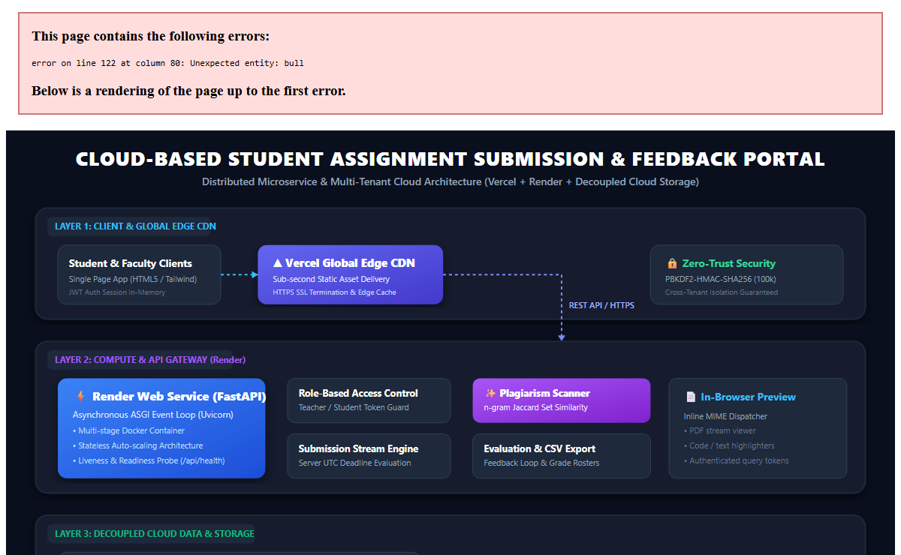
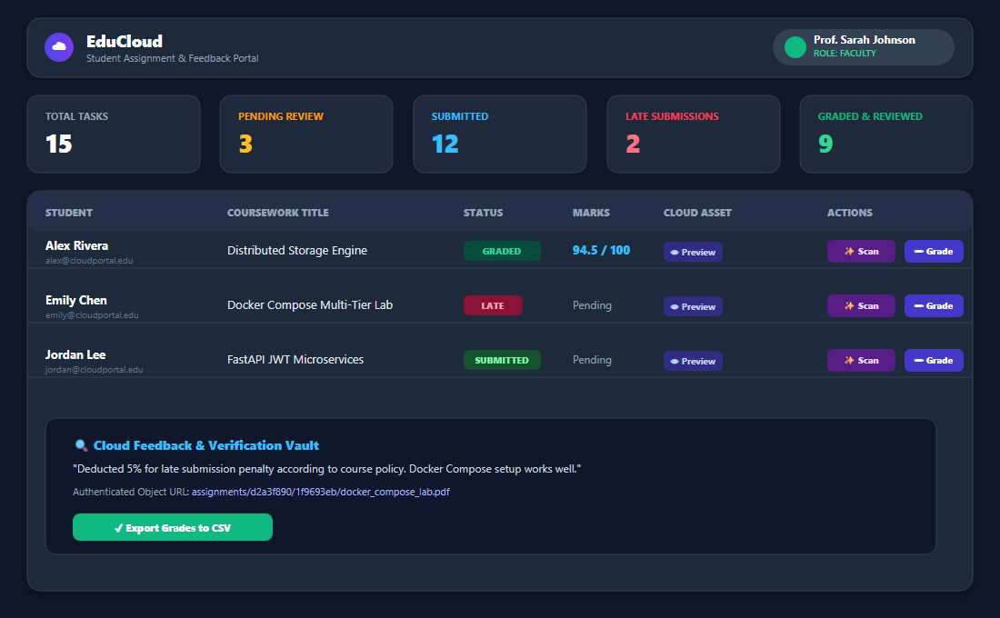
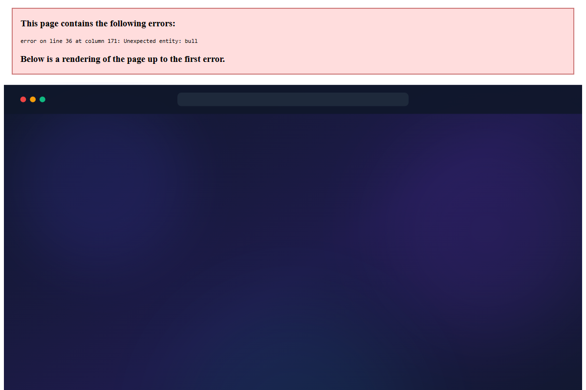
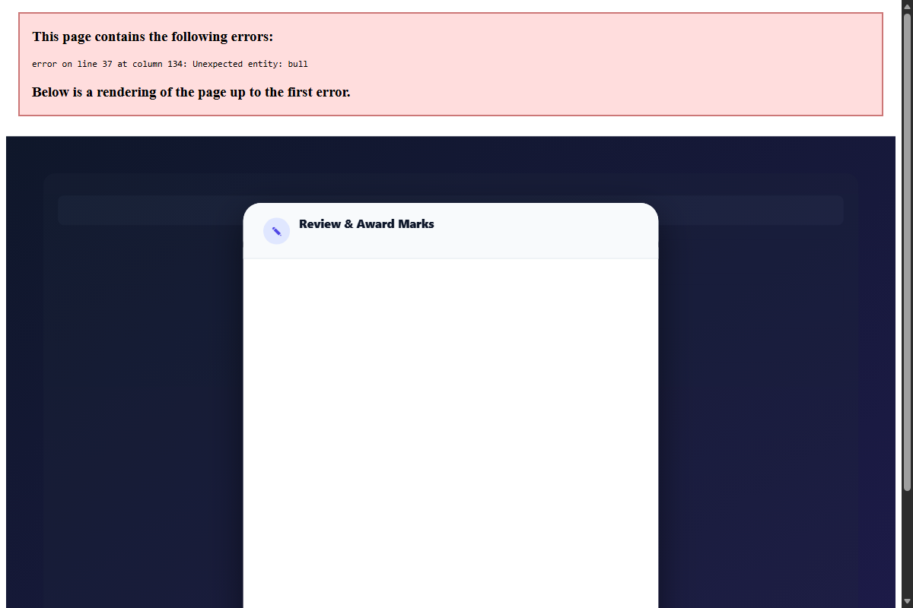
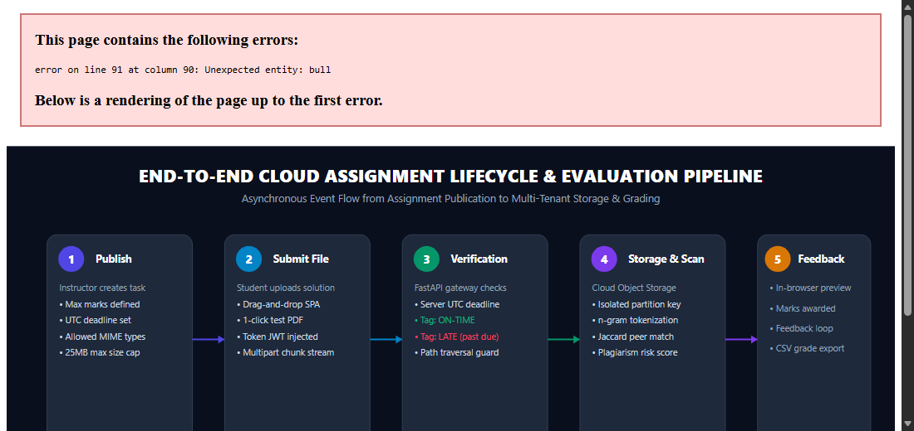
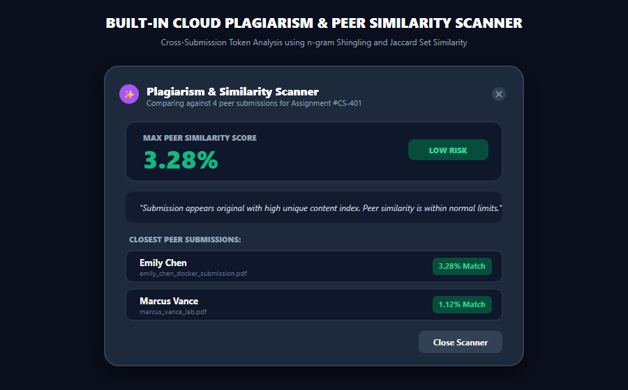
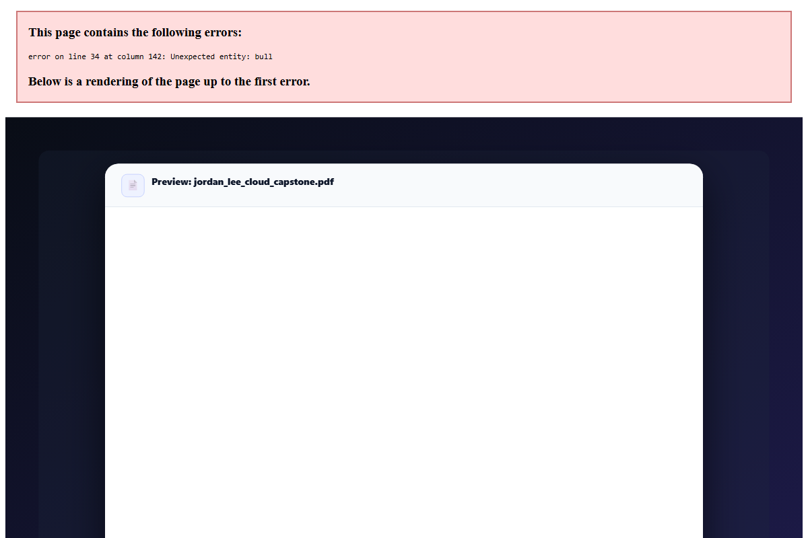

# 📸 Cloud Assignment Submission Portal — Visual Asset Catalog

This folder contains high-resolution **PNG images** and **SVG vector diagrams** for the **Cloud-Based Student Assignment Submission & Feedback Portal**.

Both formats are provided for maximum convenience:
- 🖼️ **PNG Format**: Ready for immediate upload to **LinkedIn, Twitter, Discord, WhatsApp, PowerPoint slides, Word, and Resumes** (platforms that don't accept raw SVG).
- ⚡ **SVG Vector Format**: Infinite scalability for web displays, print, and high-DPI retina rendering.

---

## 🖼️ Visual Gallery & Direct Downloads

### 1. 🏗️ Architecture Topology Diagram
*Complete decoupled cloud infrastructure across Vercel, Render, Decoupled S3 Storage, PostgreSQL, and JWT Bearer Security.*
- **Direct Image**: [**`architecture_diagram.png`**](./architecture_diagram.png) *(1200 × 740 px)*
- **Vector Source**: [**`architecture_diagram.svg`**](./architecture_diagram.svg)
- **Direct Markdown Embed**: ``

<p align="center">
  
</p>

---

### 2. 📊 Faculty Grading Desk & Student Portal
*Instructor evaluation dashboard with active assignment queues, submission status pills, and marks breakdown.*
- **Direct Image**: [**`dashboard_preview.png`**](./dashboard_preview.png) *(1100 × 680 px)*
- **Vector Source**: [**`dashboard_preview.svg`**](./dashboard_preview.svg)
- **Direct Markdown Embed**: ``

<p align="center">
  
</p>

---

### 3. 🔐 Institutional Login & 1-Click Demo Profiles
*Institutional authentication card featuring 1-click pre-seeded Faculty (Prof. Sarah) and Student (Alex Chen) logins.*
- **Direct Image**: [**`login_portal_preview.png`**](./login_portal_preview.png) *(1200 × 800 px)*
- **Vector Source**: [**`login_portal_preview.svg`**](./login_portal_preview.svg)
- **Direct Markdown Embed**: ``

<p align="center">
  
</p>

---

### 4. 📝 Faculty Rubric Grading, Qualitative Feedback & Presets
*Evaluation modal with rubric marks awarding and 1-click feedback chips (Outstanding, Well-documented, Minor Bug, Late Policy).*
- **Direct Image**: [**`grading_evaluation_preview.png`**](./grading_evaluation_preview.png) *(1200 × 800 px)*
- **Vector Source**: [**`grading_evaluation_preview.svg`**](./grading_evaluation_preview.svg)
- **Direct Markdown Embed**: ``

<p align="center">
  
</p>

---

### 5. ⚡ End-to-End Assignment Submission Pipeline
*5-stage asynchronous lifecycle from teacher assignment publication to student upload, deadline check, and grading.*
- **Direct Image**: [**`submission_flow.png`**](./submission_flow.png) *(1100 × 520 px)*
- **Vector Source**: [**`submission_flow.svg`**](./submission_flow.svg)
- **Direct Markdown Embed**: ``

<p align="center">
  
</p>

---

### 6. ✨ Built-In Plagiarism & Peer Similarity Scanner
*Real-time tokenized n-gram Shingling and Jaccard Set Similarity analysis comparing submissions across student cohorts.*
- **Direct Image**: [**`plagiarism_scanner_preview.png`**](./plagiarism_scanner_preview.png) *(900 × 560 px)*
- **Vector Source**: [**`plagiarism_scanner_preview.svg`**](./plagiarism_scanner_preview.svg)
- **Direct Markdown Embed**: ``

<p align="center">
  
</p>

---

### 7. 📄 In-Browser Document Preview with Cloud Asset Streaming
*Inline PDF reader streaming directly from multi-tenant cloud object storage with SHA-256 integrity checks.*
- **Direct Image**: [**`file_preview_modal.png`**](./file_preview_modal.png) *(1200 × 800 px)*
- **Vector Source**: [**`file_preview_modal.svg`**](./file_preview_modal.svg)
- **Direct Markdown Embed**: ``

<p align="center">
  
</p>

---

## 🚀 Ready-to-Use LinkedIn & Social Media Post Template

```markdown
🚀 Excited to share my latest cloud engineering capstone: EduCloud — A Decoupled Cloud Assignment Submission & Feedback Portal!

Key Engineering Highlights:
🔹 Decoupled Storage: Binary payloads (PDFs, ZIPs) stream into multi-tenant S3-compatible object storage, keeping the transactional SQL database lean and fast.
🔹 Stateless Microservice: FastAPI ASGI backend running containerized on Render with horizontal autoscaling.
🔹 Global Edge Delivery: Static Single Page Application delivered globally via Vercel Edge CDN with sub-second response times.
🔹 Automated Cloud Clock: Server-side NTP-synchronized UTC deadline verification prevents client-side clock tampering and auto-flags late submissions.
🔹 Automated Plagiarism Engine: Real-time n-gram Shingling & Jaccard Set Similarity scanner detects overlap across peer submissions.
🔹 Zero-Trust RBAC: PBKDF2-HMAC-SHA256 password hashing with signed JWT bearer authentication.

Check out the live demo and open-source repo:
GitHub: https://github.com/rohitsingh83/Cloud-Assignment-Submission-Portal
Backend API Docs: https://cloud-assignment-portal-backend.onrender.com/docs
```
