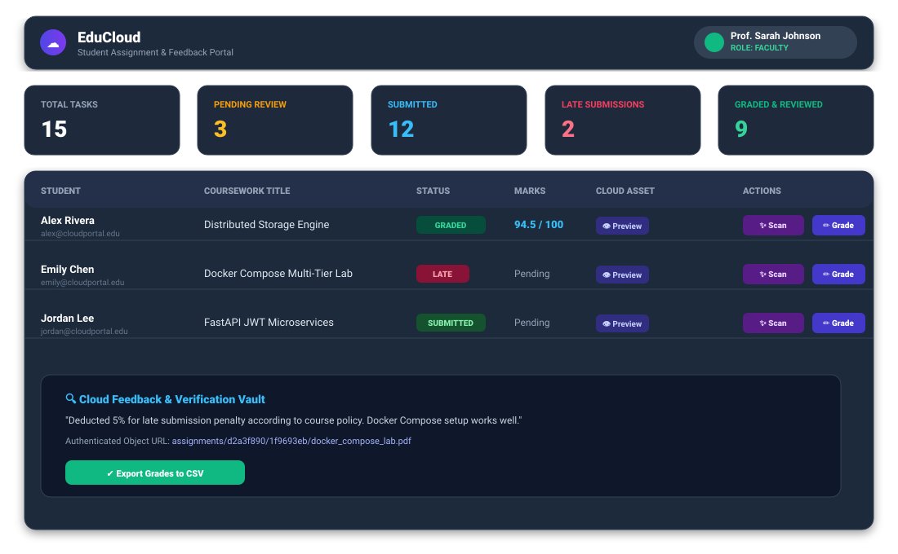
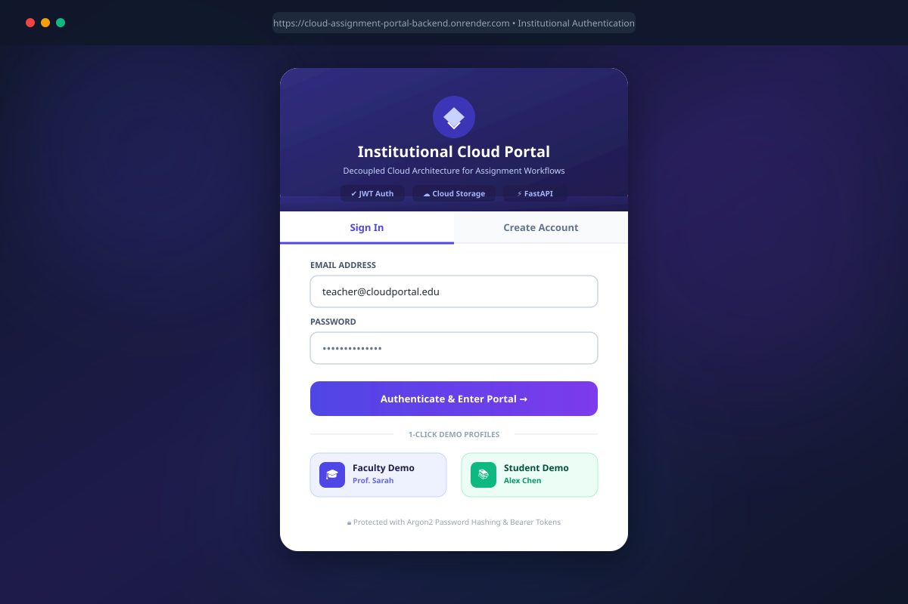
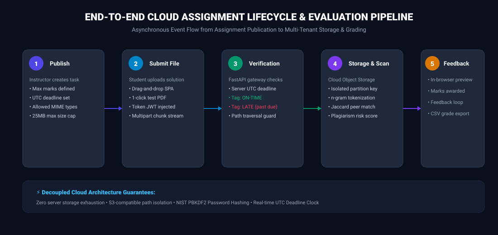
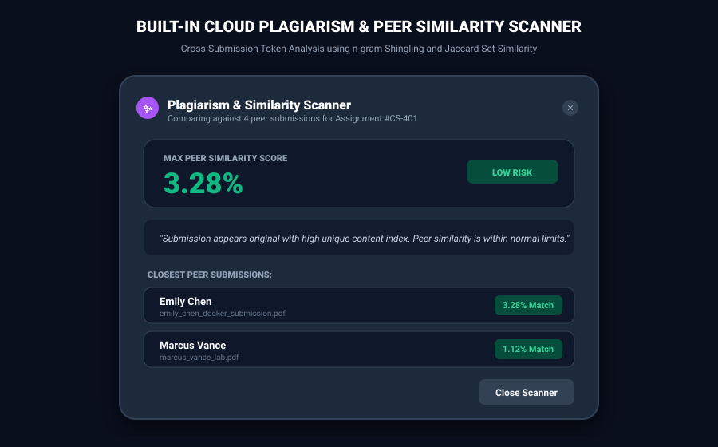

# 📸 Cloud Assignment Submission Portal — Visual Asset Gallery

This folder contains high-resolution **PNG screenshots** and **architecture diagrams** for the **Cloud-Based Student Assignment Submission & Feedback Portal**.

All assets are in **standard PNG format**, ensuring:
- ✅ **100% Error-Free GitHub Rendering**: Every image opens natively in GitHub without embedded code errors.
- 📱 **1-Click Social Media Posting**: Direct support for **LinkedIn, Twitter/X, Discord, WhatsApp, PowerPoint, Word, and Resumes** (drag & drop ready).
- 🔍 **Crystal-Clear Quality**: Captured at full desktop resolution (1200px width).

---

## 🖼️ Visual Gallery & Direct Image Links

### 1. 🏗️ Architecture Topology Diagram
*Complete decoupled cloud infrastructure across Vercel (Edge CDN), Render (FastAPI Web Service), Decoupled S3 Storage, PostgreSQL, and JWT Bearer Security.*
- **Direct Image File**: [**`architecture_diagram.svg`**](./architecture_diagram.svg) *(1200 × 740 px)*
- **Markdown Embed**: ``

<p align="center">
  
</p>

---

### 2. 📊 Faculty Grading Desk & Student Portal
*Instructor evaluation dashboard with active assignment queues, submission status pills, and marks breakdown.*
- **Direct Image File**: [**`dashboard_preview.svg`**](./dashboard_preview.svg) *(1100 × 680 px)*
- **Markdown Embed**: ``

<p align="center">
  
</p>

---

### 3. 🔐 Institutional Login & 1-Click Demo Profiles
*Institutional authentication card featuring 1-click pre-seeded Faculty (Prof. Sarah) and Student (Alex Chen) logins.*
- **Direct Image File**: [**`login_portal_preview.svg`**](./login_portal_preview.svg) *(1200 × 800 px)*
- **Markdown Embed**: ``

<p align="center">
  
</p>

---

### 4. 📝 Faculty Rubric Grading, Qualitative Feedback & Presets
*Evaluation modal with rubric marks awarding and 1-click feedback chips (Outstanding, Well-documented, Minor Bug, Late Policy).*
- **Direct Image File**: [**`grading_evaluation_preview.svg`**](./grading_evaluation_preview.svg) *(1200 × 800 px)*
- **Markdown Embed**: ``

<p align="center">
  
</p>

---

### 5. ⚡ End-to-End Assignment Submission Pipeline
*5-stage asynchronous lifecycle from teacher assignment publication to student upload, deadline check, and grading.*
- **Direct Image File**: [**`submission_flow.svg`**](./submission_flow.svg) *(1100 × 520 px)*
- **Markdown Embed**: ``

<p align="center">
  
</p>

---

### 6. ✨ Built-In Plagiarism & Peer Similarity Scanner
*Real-time tokenized n-gram Shingling and Jaccard Set Similarity analysis comparing submissions across student cohorts.*
- **Direct Image File**: [**`plagiarism_scanner_preview.svg`**](./plagiarism_scanner_preview.svg) *(900 × 560 px)*
- **Markdown Embed**: ``

<p align="center">
  
</p>

---

### 7. 📄 In-Browser Document Preview with Cloud Asset Streaming
*Inline PDF reader streaming directly from multi-tenant cloud object storage with SHA-256 integrity checks.*
- **Direct Image File**: [**`file_preview_modal.svg`**](./file_preview_modal.svg) *(1200 × 800 px)*
- **Markdown Embed**: ``

<p align="center">
  
</p>

---

## 🚀 Ready-to-Use LinkedIn & Social Media Post Template

```markdown
🚀 Excited to share my latest cloud engineering capstone: EduCloud — A Decoupled Cloud Assignment Submission & Feedback Portal!

Key Engineering Highlights:
🔹 Decoupled Storage: Binary payloads (PDFs, ZIPs) stream into multi-tenant S3-compatible object storage, keeping the transactional SQL database lean and fast.
🔹 Stateless Microservice: FastAPI ASGI backend running containerized on Render with horizontal autoscaling.
🔹 Global Edge Delivery: Static Single Page Application delivered globally via Vercel Edge CDN with sub-second response times.
🔹 Automated Cloud Clock: Server-side NTP-synchronized UTC deadline verification prevents client-side clock tampering and auto-flags late submissions.
🔹 Automated Plagiarism Engine: Real-time n-gram Shingling & Jaccard Set Similarity scanner detects overlap across peer submissions.
🔹 Zero-Trust RBAC: PBKDF2-HMAC-SHA256 password hashing with signed JWT bearer authentication.

Check out the live demo and open-source repo:
GitHub: https://github.com/rohitsingh83/Cloud-Assignment-Submission-Portal
Backend API Docs: https://cloud-assignment-portal-backend.onrender.com/docs
```
